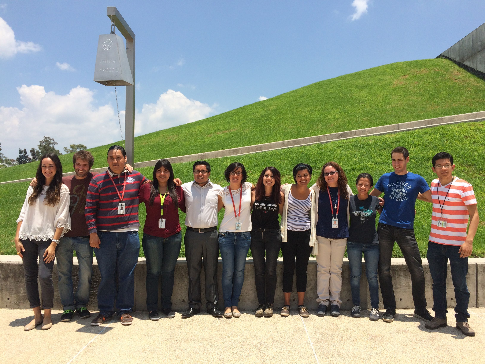

# Lab-de-Genomica-para-la-Biodiversificacion
Con este script se van a crear una carpeta para cada miembro del laboratorio   
Primero debe de haber un documento de texto con la lista de nombres completos de los miembros del laboratorio separados por un enter  
Antes de correr el script, reemplazar Lista.txt por el nombre del archivo con la lista del laboratorio  
`bash hacercarpetas.sh Lista.txt`

